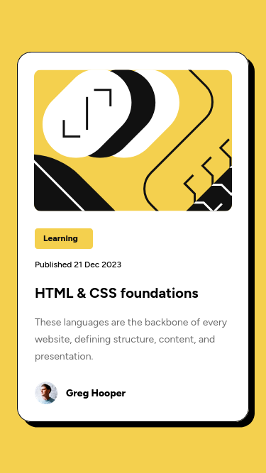

# Frontend Mentor - Blog preview card solution

This is a solution to the [Blog preview card challenge on Frontend Mentor](https://www.frontendmentor.io/challenges/blog-preview-card-ckPaj01IcS). Frontend Mentor challenges help you improve your coding skills by building realistic projects. 

## Table of contents

- [Overview](#overview)
  - [The challenge](#the-challenge)
  - [Screenshot](#screenshot)
  - [Links](#links)
- [My process](#my-process)
  - [Built with](#built-with)
  - [What I learned](#what-i-learned)
  - [Continued development](#continued-development)
  - [AI Collaboration](#ai-collaboration)
- [Author](#author)

## Overview

### The challenge

Users should be able to:

- See hover and focus states for all interactive elements on the page

### Screenshot

### Links

- Solution URL: [Frontend Mentor Blog Preview Card Challenge Solution](https://github.com/julien-vaz/frontend-mentor-blog-preview-card)
- Live Site URL: [Frontend Mentor Blog Preview Card Challenge Live Site](https://julien-vaz.github.io/frontend-mentor-blog-preview-card/)

## My process

### Built with

- Semantic HTML5 markup
- CSS
- Flexbox
- Mobile-first workflow

### What I learned

This time, I've given a try on Figma and was amazed by its capabilities. I could guide myself through the design especification fluidly. I'm gonna use it on my projects from now on! Excited to learn more!

### Continued development

One topic I'm curious about, and I'll keeping studying it, is CSS animations. I guess they are lighter than JS animations, which helps me to test my projects locally.

### AI Collaboration

I struggled to make both blog-title and blog-short-description adjust to their expected desktop heights, so I reach out for GitHub Copilot. Again, it failed to provide me meaningful explanations.

## Author

- Frontend Mentor - [@julien-vaz](https://www.frontendmentor.io/profile/julien-vaz)
